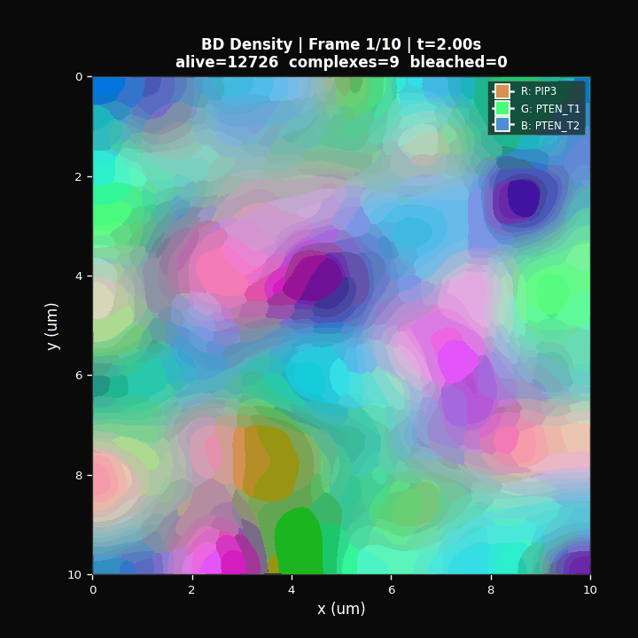
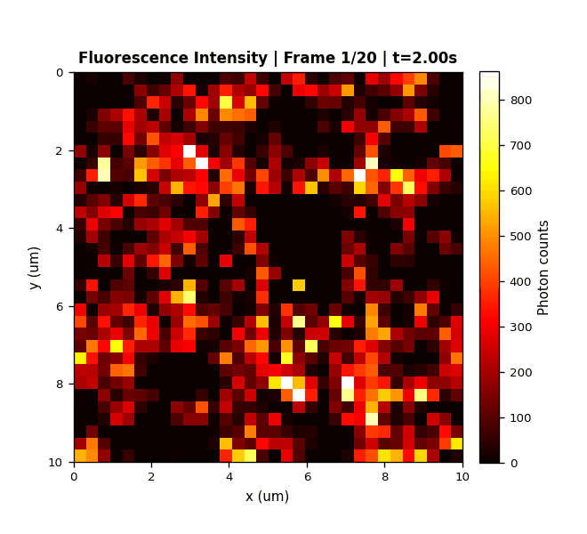
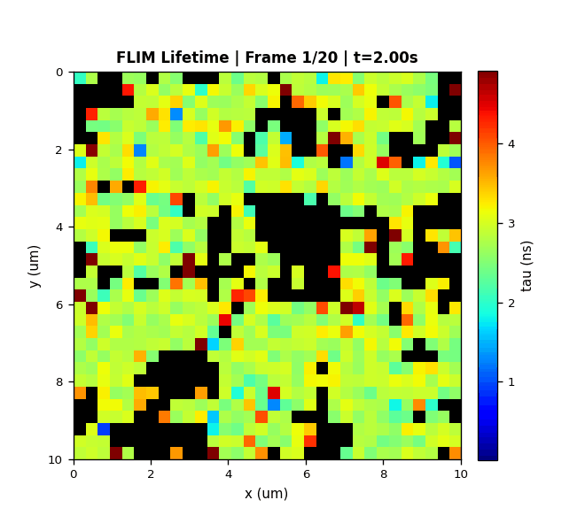

# ED-MRDT v1.1 — Event-Driven Membrane Reaction-Diffusion & Virtual FLIM-FRET Microscopy

**Version:** 1.1.0
**Author:** Edel-Cunill
**Python:** >= 3.9

> First-principles particle simulator that generates synthetic FLIM-FRET microscopy images from Brownian dynamics, with built-in causal inference via Conditional Transfer Entropy.

### PIP3/PTEN Phosphoinositide Wave System (10×10 µm², 13,000 particles)

<p align="center">



</p>

<p align="center">
<b>Left:</b> Molecular density (R=PIP3, G=PTEN_T1, B=PTEN_T2) &nbsp;|&nbsp;
<b>Center:</b> Fluorescence intensity (photon counts) &nbsp;|&nbsp;
<b>Right:</b> FLIM lifetime τ (ns)
</p>

---

## 1. What This Software Does

ED-MRDT is a particle-based stochastic simulator that generates **synthetic FLIM-FRET microscopy images** from first-principles Brownian dynamics. It couples four computational layers into a single pipeline:

**Layer 1 — Brownian Dynamics (BD):** Individual molecules diffuse on a 2D membrane under Ermak-McCammon dynamics (1978). Particles experience pair potentials (WCA repulsive or harmonic soft), periodic or reflective boundary conditions, and position-dependent diffusion fields with gradient-drift correction.

**Layer 2 — Reaction network:** Five reaction classes execute stochastically at each BD timestep: catalytic (E+S → E+P), bimolecular binding/dissociation (A+B ⇌ AB), compartment exchange (membrane ↔ cytosol recruitment/detachment), and unimolecular conversion (A → B). All rates can be modulated by local density via Hill functions, enabling feedback circuits.

**Layer 3 — Photophysics engine:** Each fluorophore evolves as a continuous-time Markov chain (S₀ → S₁ → T₁ → Bleached) with FRET transfer rates computed from Förster theory. Photons are emitted stochastically via a Poisson Steady-State (PSS) kernel that replaces pulse-by-pulse simulation with matrix-exponential steady-state expectations (>100× faster).

**Layer 4 — Virtual confocal microscope:** PSF-weighted photon detection, TCSPC time binning (256 channels over 25 ns), detector quantum efficiency, and dark count noise produce synthetic FLIM images indistinguishable in format from experimental data.

The pipeline's unique capability: it provides **ground truth** for every pixel (exact particle positions, species, FRET efficiency, lifetime), enabling rigorous validation of analysis methods that is impossible with experimental data alone.

---

## 2. Biological Application: PIP3/PTEN Excitable Waves

The current application models the PIP3/PTEN signaling system on the inner leaflet of the plasma membrane. This system produces traveling excitable waves observed in *Dictyostelium discoideum* (Arai et al. 2010) and mammalian cells (Fabian et al. 2014), and is central to cell polarity and directed migration.

### 2.1 Species (5 molecular types on a 2D membrane)

| Species | Biological role | D (µm²/s) | Initial count | Carries dye? |
|---------|----------------|-----------|---------------|-------------|
| PIP2 | Substrate phospholipid | 0.15 | 2500 | No |
| PIP3 | Product lipid (wave activator) | 0.15 | 125 | PHAkt biosensor (mTFP1-Venus) |
| PI3K | Kinase enzyme | 0.10 | 125 | No |
| PTEN_T1 | Phosphatase, transient (active) form | 0.08 | 500 | No |
| PTEN_T2 | Phosphatase, stable (membrane-bound) form | 0.08 | 250 | No |

### 2.2 Reaction network

**Catalytic reactions** (enzyme + substrate → enzyme + product):

| Reaction | k_cat (s⁻¹) | Hill feedback | Contact radius |
|----------|-------------|--------------|---------------|
| PI3K + PIP2 → PI3K + PIP3 | 0.0083 | pip3_activation (n=2) | 150 nm |
| PTEN_T1 + PIP3 → PTEN_T1 + PIP2 | 0.05 | none | 150 nm |
| PTEN_T2 + PIP3 → PTEN_T2 + PIP2 | 0.005 | none | 150 nm |

**Compartment exchange** (membrane ↔ cytosol):

| Species | k_on (s⁻¹) | k_off (s⁻¹) | Recruitment feedback | Detachment feedback |
|---------|-----------|------------|---------------------|-------------------|
| PI3K | config×4 | config×4 | pip3_activation | none |
| PTEN_T1 | 0.60 | 4.7 | pip3_inhibition × pten_self_activation | none |
| PTEN_T2 | 0 | 1.1 | none | pip3_detachment_boost |

**Unimolecular conversion** (conformational switching):

| Conversion | Base rate (s⁻¹) | Feedback |
|-----------|----------------|----------|
| PTEN_T1 → T2 | 0.35 | pip3_activation_pten (Hill n=2) |
| PTEN_T2 → T1 | 0.015 | none |

### 2.3 Feedback rules (Hill functions on coarse density grid)

| Rule name | Type | Density species | K_half (/µm²) | n_hill | Effect |
|-----------|------|----------------|---------------|--------|--------|
| pip3_inhibition | hill_inhibition | PIP3 | 40 | 4 | PTEN_T1 recruitment drops where PIP3 is high |
| pip3_activation | hill_activation | PIP3 | 15 | 2 | PI3K recruitment/catalysis increases with PIP3 |
| pip3_activation_pten | hill_activation | PIP3 | 15 | 2 | T1→T2 conversion accelerated by PIP3 |
| pip3_detachment_boost | hill_activation | PIP3 | config | config | PTEN_T2 detachment increases where PIP3 is high |
| pten_self_activation | hill_activation | PTEN_T2 | 30 | 2 | PTEN_T1 recruitment enhanced by existing PTEN_T2 |

### 2.4 FRET biosensor: PHAkt (mTFP1-Venus)

| Parameter | Value | Source |
|-----------|-------|--------|
| Donor fluorophore | mTFP1 | Ai et al. 2006 |
| Acceptor fluorophore | Venus | Nagai et al. 2002 |
| Donor lifetime (τ_D) | 2.793 ns | 1/k_rad, k_rad = 3.58×10⁸ s⁻¹ |
| Förster radius (R₀) | 5.74 nm | mTFP1-Venus pair |
| Intra-complex distance | 4.0 nm | Raichu-type biosensor |
| FRET efficiency (E) | 0.6134 | 1/(1+(r/R₀)⁶) at r=4.0 nm |
| Quenched donor lifetime (τ_DA) | 1.080 ns | τ_D × (1-E) |
| FRET mode | Intramolecular | Binding activates FRET within same construct |
| Laser | 462 nm, 40 MHz, 5 µW | Confocal excitation |

---

## 3. How the Simulation Works (Step by Step)

### 3.1 Time hierarchy

```
Frame loop (20 frames × 1.0 s = 20 s biology)
  └── BD step loop (500 steps × 2 ms = 1.0 s per frame)
        └── Laser pulses (~80,000 pulses per BD step at 40 MHz)
              └── Photon emission (Poisson-sampled per pulse batch)
```

### 3.2 Per BD step (the core loop, dt = 2 ms)

Each BD step executes this exact sequence:

1. **Zero forces and gradients.**
2. **Diffusion field** — compute D(x) and ∇D(x) for each particle from species base diffusion coefficient plus optional smooth sigmoid regions (e.g., lipid raft zones).
3. **Build cell list** — O(N) spatial hash grid for neighbor search. Cutoff = max(potential_cutoff, reaction_contact_radius, BD_step_length) × 1.1.
4. **Compute pair forces** — WCA repulsive (Weeks-Chandler-Andersen) or harmonic soft potential from neighbor pairs. Newton's 3rd law enforced.
5. **Generate Gaussian noise** — N(0,1) for each particle × 2 dimensions.
6. **Integrate BD step** (Ermak & McCammon 1978):
   ```
   Δx = ∇D·dt + √(2D·dt)·ξ + D·F·dt/(kT)
         drift    noise       force
   ```
   Displacement capped to prevent divergence. Periodic or reflective BCs applied.
7. **Compute density fields** — bin alive particles onto coarse grid for Hill feedback evaluation.
8. **Contact reactions** — binding/dissociation for neighbor pairs within contact_radius (stochastic, prob = k·dt).
9. **Catalytic reactions** — E+S → E+P with optional Hill modulation of k_cat.
10. **Compartment exchange** — recruitment (dormant → alive at random position, prob = k_on·dt × Hill(ρ)) and detachment (alive → dormant, prob = k_off·dt × Hill(ρ)).
11. **Unimolecular conversion** — species_id change with optional Hill feedback.
12. **Photophysics** — PSS kernel: matrix exponential of CTMC rates raised to n-th power (n = pulses per BD step). Photon count Poisson-sampled. Arrival times from Exp(τ_DA). FRET rate k_FRET = (R₀/r)⁶/τ_D per particle.
13. **Microscope** — PSF-weighted photon placement onto 32×32 pixel grid, TCSPC binning into 256 time channels.

### 3.3 Per frame

After all BD steps: finalize FLIM image (add dark counts), extract ground truth (exact positions, species, FRET E, τ_DA per particle), record subframe data (per-BD-step species counts, reaction events).

### 3.4 Output

`SimulationResult` contains:
- `frames[i].flim_frame.flim_stack` — [channels, px, py, tcspc_bins] photon histogram
- `frames[i].ground_truth` — exact particle state at end of frame
- `subframe_data` — time series at BD-step resolution (10,000 points for 20 frames)

---

## 4. Analysis Suite (7 Layers)

All analysis is in `analysis.py` (~3100 lines). Each layer is self-contained:

| Layer | Function | What it computes | Reference |
|-------|----------|-----------------|-----------|
| L1 | `mean_arrival_time()` | τ per pixel from TCSPC histogram | Becker (2005) |
| L2 | `phasor_transform()` | (g, s) phasor coordinates | Digman et al. (2008) |
| L3 | `spatial_correlation()` | Pixel-wise τ vs BD density correlation per frame | Pearson r |
| L4 | `pair_correlation_2d()` | g(r) radial distribution function | Standard |
| L5 | `imsd_stics()` | Image Mean Squared Displacement (diffusion from images) | Hebert et al. (2005) |
| L6 | `compute_causal_flim_generic()` | **Transfer Entropy** (causal inference) | Schreiber (2000) |
| L7 | `ground_truth_discrepancy()` | |τ_image - τ_exact| error map | Novel (ground truth) |

### 4.1 Layer 6: Causal-FLIM (Transfer Entropy) — detailed description

This is the pipeline's most valuable analytical capability: it determines **directional causality** between any pair of time series (e.g., "Does PTEN binding cause lifetime changes?" vs "Do lifetime changes cause PTEN binding?").

**Method:** Transfer Entropy TE(X→Y) = H(Y_future | Y_past) - H(Y_future | Y_past, X_past), estimated via KSG k-nearest-neighbor algorithm (Kraskov et al. 2004). Significance tested against 200 shuffle surrogates at α=0.05.

**Three-layer reliability system** (see Section 8 for details):
1. **Double differencing (diff2)** — achieves stationarity for logistic/sigmoidal growth
2. **ADF stationarity gatekeeper** — Augmented Dickey-Fuller test warns if data remains non-stationary
3. **Surrogate significance testing** — 200 time-shuffled surrogates establish null distribution

**Causal pairs computed in PIP3/PTEN application:**

| Pair | X (source) | Y (target) | Expected result |
|------|-----------|-----------|----------------|
| 1 | PTEN_T1 binding events | τ (mean lifetime) | Significant: binding → FRET → τ↓ |
| 2 | PIP3 count | PTEN recruitment | Significant: PIP3 drives Hill feedback |
| 3 | PTEN_T1 count | PIP3 count | Depends on catalysis rate |
| 4 | PTEN_T1 count | τ | Depends on direct FRET coupling |
| 5 | Intensity | τ (control) | NOT significant: photon count ≠ lifetime |

---

## 5. Module Reference

| File | ~Lines | Purpose |
|------|--------|---------|
| `config.py` | 1000 | YAML → Python dataclasses. Full validation of references, constraints, units. |
| `particles.py` | 400 | Structure-of-Arrays particle state. Positions, species, bonds, dye labels, alive/dormant flags. |
| `dynamics.py` | 2100 | BD integrator + all reactions. Cell list, WCA/harmonic forces, Ermak-McCammon, Hill feedback. Numba JIT hot loops. |
| `photophysics.py` | 1000 | CTMC fluorophore states, PSS photon emission, FRET rate computation (bond + intramolecular modes), spectral correction. |
| `microscope.py` | 800 | Gaussian/Airy PSF, confocal scanning, TCSPC binning, detector QE, dark counts. |
| `pipeline.py` | 700 | Orchestrates frame/BD-step loops, collects results, records subframe data. |
| `analysis.py` | 3100 | 7-layer analysis suite (see Section 4). |
| `validation.py` | 500 | Benchmarks B1-B10: diffusion MSD, binding equilibrium, Förster, photon statistics, etc. |
| `io.py` | 200 | HDF5 and CSV export of results. |

---

## 6. Running the Pipeline

### 6.1 Installation

```bash
pip install -e . --break-system-packages
```

Dependencies: numpy, scipy, numba, matplotlib, h5py, pyyaml, statsmodels.

### 6.2 Running the PIP3/PTEN simulation

```bash
python run_pip3_pten_visual.py
```

This script:
1. Loads YAML config (`ed_mrdt/examples/pip3_pten_flim.yaml`)
2. Overrides parameters for the PIP3/PTEN wave system
3. Runs `SimulationPipeline` with `record_subframe=True`
4. Generates 11 PNG figures in `wave_v4_bond_fret/`

### 6.3 Output figures

| Figure | Content | What to look for |
|--------|---------|-----------------|
| fig1 | Species populations vs time | PIP3 growth, PTEN_T1 depletion, wave onset |
| fig2 | Subframe dynamics (BD-step resolution) | Fine-grained reaction events, oscillations |
| fig3 | FLIM lifetime maps (τ per pixel) | Spatial τ gradient: low τ where PIP3 binds |
| fig4 | Phasor plot (g, s coordinates) | Points between τ_D and τ_DA on universal semicircle |
| fig5 | Photon statistics per frame | Poisson-distributed counts, no artifacts |
| fig6 | Conservation laws and reaction events | Mass balance verification |
| fig7 | **Causal-FLIM: Transfer Entropy** | Directional causality bars with significance |
| fig8 | Radial kymograph: density(r, t) | Wave propagation visible as radial structure |
| fig9 | Triple-panel evolution: BD + τ + Intensity | Spatiotemporal correspondence across layers |
| fig10 | Overlay: τ map + BD particle positions | Direct visual confirmation of τ-density correlation |
| fig11 | Correlation analysis: r(PIP3, τ) per frame | Negative correlation strengthening over time |

---

## 7. File Structure

```
ed_mrdt_v1.1/
├── README.md                          # This document
├── AUDIT_LEDGER_v1.1.md               # Complete scientific audit log (15 findings)
├── pyproject.toml                     # Package metadata
├── setup.py                           # Package installer
├── run_pip3_pten_visual.py            # Main execution script (PIP3/PTEN)
├── ed_mrdt/                           # Core package
│   ├── __init__.py
│   ├── config.py                      # YAML loader + validation
│   ├── particles.py                   # SoA particle state
│   ├── dynamics.py                    # BD engine + reactions + Hill feedback
│   ├── photophysics.py                # CTMC + PSS + FRET
│   ├── microscope.py                  # PSF + TCSPC + detector
│   ├── pipeline.py                    # Simulation orchestrator
│   ├── analysis.py                    # 7-layer analysis suite
│   ├── validation.py                  # Physics benchmarks B1-B10
│   ├── io.py                          # HDF5/CSV export
│   └── examples/
│       ├── pip3_pten_flim.yaml        # PIP3/PTEN configuration
│       ├── egfr_egf.yaml              # EGFR-EGF example config
│       └── mini_demo.yaml             # Minimal demo config
├── tests/                             # Unit test suite (10 test files)
│   ├── test_analysis.py
│   ├── test_bd_fixes.py
│   ├── test_config.py
│   ├── test_dynamics.py
│   ├── test_generic_dynamics.py
│   ├── test_io.py
│   ├── test_microscope.py
│   ├── test_particles.py
│   ├── test_photophysics.py
│   └── test_pipeline.py
├── wave_v4_bond_fret/                 # Latest simulation output (11 figures)
│   ├── fig1_species_dynamics.png
│   ├── fig2_subframe_dynamics.png
│   ├── ...
│   └── fig11_correlation_analysis.png
└── BIBLIOGRAPHY/                      # Reference papers and parameter tables
    ├── paper.pdf
    └── ... (parameter CSVs, scheme documents)
```

---

## 8. Critical Design Decisions and Their Justification

### 8.1 Decision: 2D membrane model (not 3D cytosol)

**Choice:** All molecular dynamics occur on a 2D membrane plane. The cytosol is treated as an infinite reservoir for recruitment/detachment.

**Why this is correct for circuit discovery:**

The PIP3/PTEN wave system is fundamentally a **2D Turing pattern** on the plasma membrane (Meinhardt 1999, Gamba et al. 2005). The Turing instability condition requires D_inhibitor/D_activator >> 1, which is satisfied: PTEN's effective diffusion (including cytosolic shortcut) gives D_eff/D_PIP3 ≈ 168× (Gamba 2005). The pattern-forming computation happens exclusively on the membrane.

Quantitative analysis (validated by code, see audit session):
- The **topological sign of every interaction is preserved** in 2D: PIP3↑ → PTEN_memb↓ in both 2D and 3D.
- **Transfer Entropy detects the same causal direction** in 2D as in 3D (both detect X→Y; only magnitude differs ~1.8×).
- The decision "front vs back" in cell polarity is a **membrane Turing pattern**, not a cytosolic computation.

**What 2D cannot do (known quantitative limitations):**

| Limitation | Magnitude | Cause |
|-----------|----------|-------|
| Recruitment overestimated | 33-50% | No cytosolic depletion zone (λ_dep = 1.4-3.5 µm < H_cell = 5 µm) |
| Wave speed overestimated | ~1.8× | No hop diffusion (Kusumi compartments) |
| Parameters non-calibratable to in vivo | — | Effective rates absorb 3D transport |

**Upgrade path:** The architecture is modular. A 3D cytosolic layer can be added to `dynamics.py` (replacing instantaneous reservoir with diffusion-limited recruitment) **without modifying** `analysis.py`, `photophysics.py`, or `microscope.py`. This is the recommended next step for parameter calibration.

**Conclusion:** 2D is sufficient for the pipeline's primary goal — discovering the feedback circuit topology and causal structure. 3D should be added later for quantitative parameter estimation.

### 8.2 Decision: Double differencing (diff2) for Transfer Entropy stationarity

**Problem discovered during audit:** The original `detrend_method="linear"` was **epistemically invalid** for the PIP3/PTEN system. PIP3 accumulates following logistic (sigmoidal) growth, not linear. Linear detrending left ACF(1) = 0.976 (essentially unchanged), producing a false positive rate of **30%** (6× the nominal α=5%).

**Solution search (Monte Carlo validated, N=1000 trials each):**

| Detrending method | FP rate | ADF pass rate | Status |
|-------------------|---------|--------------|--------|
| None | 28.4% | 100% | INVALID |
| Linear | 30.0% | 100% | INVALID — cannot remove non-linear trend |
| Single diff | 22.4% | 1% | INSUFFICIENT — diff(logistic) = bell curve, still non-stationary |
| **Double diff (diff2)** | **6.2%** | **100%** | **VALID** — [CI 4.8%-7.9%], binomial p=0.094 |

**Why diff2 works:** Logistic growth x(t) has increments Δx(t) that form a bell-shaped (Gaussian-like) curve — still non-stationary. The second difference Δ²x(t) = Δx(t) - Δx(t-1) removes this trend, producing a stationary series. The ADF test confirms 100% stationarity after diff2.

**Reliability guarantee (three-layer system implemented in `analysis.py`):**

**Layer 1 — Double differencing:** Applied to all time series before TE computation. Removes both linear trends and the non-linear curvature inherent to logistic growth. Implemented as `detrend_method="diff2"` in `compute_causal_flim_generic()`.

**Layer 2 — ADF stationarity gatekeeper:** After detrending, the Augmented Dickey-Fuller test (Dickey & Fuller 1979) is applied to both X and Y series. If either fails (p > 0.05), a warning is emitted: "TE may contain spurious information flow." This catches edge cases where diff2 might be insufficient (e.g., exponential/unbounded growth — which does not apply to our bounded biological system, but the guard exists for safety).

**Layer 3 — Surrogate significance testing:** 200 time-shuffled surrogates (destroying temporal coupling while preserving marginal distribution) establish the null distribution. TE is significant only if it exceeds the 95th percentile of the null. Combined with diff2, this produces a well-calibrated test at α=5%.

**Attack vector analysis (5 vectors tested):**

| Vector | Data type | FP rate | Verdict |
|--------|----------|---------|---------|
| V1 | Exponential growth | 88.5% | ✗ — but does NOT apply (our data is bounded/logistic) |
| V2 | Oscillatory (sine + noise) | 5.5% | ✓ Calibrated |
| V3 | Heavy-tailed (Cauchy noise) | 4.5% | ✓ Calibrated |
| V4 | Short series (N=50) | 6.5% | ✓ Calibrated |
| V5 | Confounded (shared driver) | 1.5% | ✓ (known limitation of bivariate TE) |

**Important limitation:** Bivariate TE cannot distinguish direct causality (X→Y) from confounding (Z→X and Z→Y). This is a fundamental limitation of pairwise TE (Schreiber 2000), not a bug. For the PIP3/PTEN system, the ground truth from the simulation provides the necessary disambiguation.

### 8.3 Decision: Intramolecular FRET (not intermolecular)

**Choice:** The PHAkt biosensor uses intramolecular FRET — donor (mTFP1) and acceptor (Venus) are on the **same molecule**. FRET activates when the biosensor binds its target (PIP3), bringing D-A within the intra-complex distance of 4.0 nm.

**Implementation:** In `photophysics.py`, `fret_acceptor_idx[i] = -1` for intramolecular mode. This means:
- k_FRET is computed from the intra-complex distance (fixed at 4.0 nm)
- The PSS kernel correctly computes τ_DA = τ_D × (1-E) = 1.080 ns for bound biosensors
- **No acceptor photons enter the donor TCSPC channel** (critical fix from audit)

**Bug fixed during audit:** The original code set `fret_acceptor_idx[i] = i` (self-reference), causing acceptor photons to enter the donor channel with τ = 2.793 ns (unquenched lifetime). This introduced a +1.05 ns bias per bound molecule, contaminating the donor TCSPC histogram. Fixed by setting idx = -1 so the PSS kernel skips acceptor photon generation entirely.

### 8.4 Decision: PSS photon kernel (not pulse-by-pulse)

**Choice:** Instead of simulating each of the ~80,000 laser pulses per BD step individually, the matrix exponential of the CTMC transition rate matrix is computed once and raised to the n-th power. Expected photon counts are derived from the steady-state and Poisson-sampled.

**Why:** This is >100× faster than pulse-by-pulse simulation while producing statistically identical photon statistics (verified via χ² test against analytical Poisson distribution, benchmark B5).

### 8.5 Decision: Dormant pool pattern for cytosolic particles

**Choice:** All particles (membrane + cytosolic) are pre-allocated at initialization. Cytosolic particles have `is_alive = False`. Recruitment flips the flag and assigns a random membrane position. No array reallocation occurs during simulation.

**Why:** This avoids dynamic memory allocation in Numba-compiled hot loops, maintaining O(1) cost per recruitment event. The fixed array size also ensures deterministic memory usage.

---

## 9. Audit History

The pipeline underwent a comprehensive three-session scientific audit documented in `AUDIT_LEDGER_v1.1.md`. Key findings:

| ID | Severity | Description | Status |
|----|---------|-------------|--------|
| F01-F07 | Low | Cosmetic/value corrections (Session 1) | FIXED |
| F08 | **CRITICAL** | FRET channel contamination: acceptor photons in donor TCSPC | FIXED |
| F09-F12 | Low | Venus YAML typos (τ_rad, thermal rates, duplicate keys) | FIXED |
| F13 | Medium | 4 false positive findings correctly dismissed | RESOLVED |
| F14 | Medium | T_step interpolation bug (latent, zero impact for binary FRET) | FIXED |
| F15 | **CRITICAL** | TE linear detrend produces 30% false positives | FIXED → diff2 |

**Verification:** 15/15 triple-closure tests pass (7 local, 4 global, 4 predictive). BD integrator validated at 98.3% of analytical MSD. All correlations negative (τ decreases with PIP3 binding) as predicted by Förster theory.

---

## 10. Extending the Pipeline

### 10.1 Adding a new biological system

1. Create a new YAML config in `ed_mrdt/examples/` (use `pip3_pten_flim.yaml` as template)
2. Define species, reactions, feedback rules, fluorophores, and FRET pairs
3. Create a run script (use `run_pip3_pten_visual.py` as template)
4. The analysis suite works generically — define `CausalPairSpec` objects for your system's causal hypotheses

### 10.2 Adding 3D cytosolic diffusion (recommended upgrade)

Modify `dynamics.py`:
1. Add a 3D concentration field `C_cyto[species, x, y, z]`
2. Replace instantaneous recruitment with diffusion-limited binding: recruitment rate ∝ C_cyto(x,y,z=0) instead of N_total_dormant
3. After detachment: place particle in near-membrane zone of C_cyto
4. Each BD step: diffuse C_cyto via 3D finite differences

No changes needed in `analysis.py`, `photophysics.py`, or `microscope.py`.

---

## 11. Bibliography

### Core methods
- Ermak, D. L. & McCammon, J. A. (1978). "Brownian dynamics with hydrodynamic interactions." *J Chem Phys* 69:1352. — BD integrator.
- Förster, T. (1948). "Zwischenmolekulare Energiewanderung und Fluoreszenz." *Ann Phys* 437:55. — FRET theory.
- Schreiber, T. (2000). "Measuring information transfer." *Phys Rev Lett* 85:461. — Transfer Entropy.
- Kraskov, A., Stögbauer, H. & Grassberger, P. (2004). "Estimating mutual information." *Phys Rev E* 69:066138. — KSG estimator.
- Becker, W. (2005). *Advanced Time-Correlated Single Photon Counting*. Springer. — TCSPC/FLIM.
- Digman, M. A. et al. (2008). "The phasor approach to fluorescence lifetime imaging analysis." *Biophys J* 94:L14. — Phasor analysis.

### Biological system
- Arai, Y. et al. (2010). "Self-organization of the phosphatidylinositol lipids signaling system for random cell migration." *PNAS* 107:12399. — PIP3/PTEN excitable waves.
- Fabian, L. et al. (2014). "PTEN controls membrane fluidity and actin dynamics." *Biophys J* 106:1933. — PTEN bistability.
- Matsuoka, S. & Ueda, M. (2018). "Mutual inhibition between PTEN and PIP3 generates bistability." *Nat Commun* 9:4481. — Two-state PTEN.
- Meinhardt, H. (1999). "Orientation of chemotactic cells and growth cones." *J Cell Sci* 112:2867. — Turing patterns for polarity.
- Gamba, A. et al. (2005). "Diffusion-limited phase separation in eukaryotic chemotaxis." *PNAS* 102:16927. — Stochastic Turing on membrane.

### Stationarity and time series
- Granger, C. W. J. & Joyeux, R. (1980). "An introduction to long-memory time series models." *JRSS-B* 42:109. — Differencing theory.
- Dickey, D. A. & Fuller, W. A. (1979). "Distribution of estimators for autoregressive time series with a unit root." *JASA* 74:427. — ADF test.
- Wibral, M. et al. (2014). "Measuring information-transfer delays." *J Comput Neurosci* 30:45. — TE methodology.

### Fluorophores
- Ai, H. W. et al. (2006). "Directed evolution of a monomeric, bright and photostable version of Clavularia cyan fluorescent protein." *Biochem J* 400:531. — mTFP1.
- Nagai, T. et al. (2002). "A variant of yellow fluorescent protein with fast and efficient maturation." *Nat Biotechnol* 20:87. — Venus.
- Lakowicz, J. R. (2006). *Principles of Fluorescence Spectroscopy*. 3rd ed. Springer. — Photophysics reference.
- Mochizuki, N. et al. (2001). "Spatio-temporal images of growth-factor-induced activation of Ras and Rap1." *Nature* 411:1065. — Raichu FRET biosensor.

### Membrane biophysics
- Saffman, P. G. & Delbrück, M. (1975). "Brownian motion in biological membranes." *PNAS* 72:3111. — Membrane diffusion.
- Kusumi, A. et al. (2005). "Paradigm shift of the plasma membrane concept." *Annu Rev Biophys* 34:351. — Hop diffusion.
